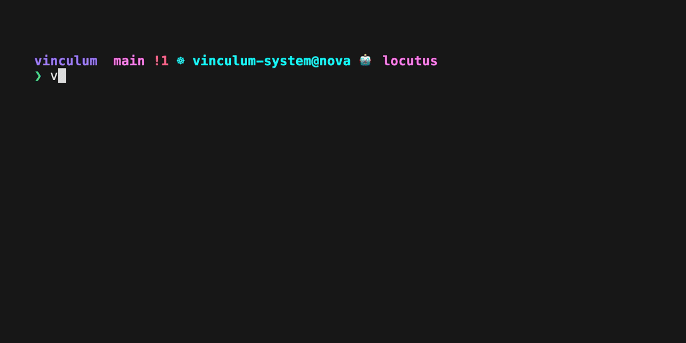
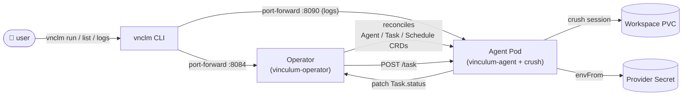
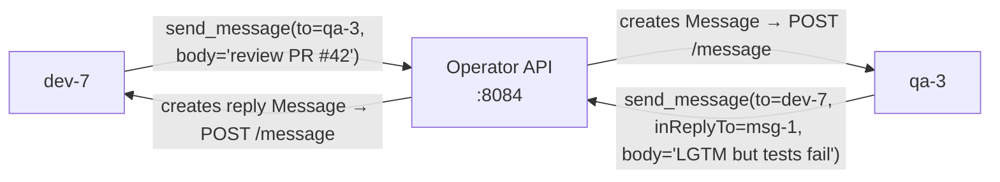
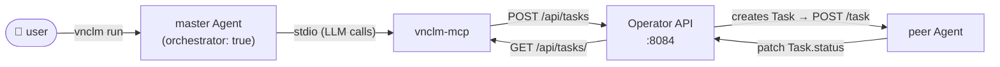
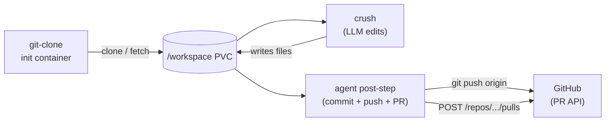

<h1 align="center">Vinculum</h1>

<p align="center">
  <em>Kubernetes-native runner for AI coding agents.</em>
</p>

<p align="center">
  <a href="https://github.com/FlorianWenzel/vinculum/actions/workflows/ci.yaml"></a>
  <a href="https://github.com/FlorianWenzel/vinculum/actions/workflows/publish-images.yaml"></a>
  <a href="https://github.com/FlorianWenzel/vinculum/releases/latest"></a>
  <a href="https://github.com/FlorianWenzel/homebrew-vinculum"></a>
  <a href="LICENSE.md"></a>
</p>

<p align="center">
  
</p>

---

> *The Vinculum is the interlink device that binds the Borg collective — a single consciousness stretched across every drone.*

Vinculum runs long-lived [`charmbracelet/crush`](https://github.com/charmbracelet/crush) agents as Kubernetes Deployments. Each **Agent** is a pod that holds an open crush session and serves a small HTTP API. Submit **Tasks** against an Agent; they execute serially in-pod, reuse the same workspace PVC, and preserve conversation history across restarts.

Flip `spec.orchestrator: true` on an Agent and it becomes a **master**: a bundled stdio MCP server (`vnclm-mcp`) wires the operator's API into the running crush session, so the LLM can `dispatch_task` / `wait_task` against peer Agents in the cluster. Hive mind out of the box.

One operator. Many agents. One shared link — the vinculum.

## Why

- **Long-lived sessions.** A pod per Agent — no per-prompt pod cold-start, and the crush session + `/workspace` PVC survive restarts.
- **Kube-native.** Declarative `Agent`, `Task`, `AgentSchedule`, `MCPServer` CRDs. One operator reconciles them into Deployments, PVCs, RBAC, Services.
- **Multi-provider.** Azure OpenAI, Anthropic, OpenAI, OpenRouter, or bring-your-own — a provider is just a labeled Secret.
- **Hive mind.** Set `orchestrator: true` on an Agent and it can dispatch Tasks to its peers via the bundled `vnclm-mcp` stdio bridge. Master agents talk to the operator API in-cluster; no extra plumbing.
- **Ships code.** Declare a repo + git credentials on the Agent, set `spec.git` on a Task, and the agent clones, branches, commits, pushes, and opens a GitHub PR — declaratively.
- **Event-driven.** `WebhookTrigger` CRs turn GitHub webhook deliveries (push, PR opened/synced, …) into Tasks, with HMAC-signed verification per trigger.
- **One binary CLI.** `vnclm` port-forwards through your active kubecontext — no exposed operator endpoint, no long-lived local state.

## Architecture



## Components

| Component | Path | Purpose |
|-----------|------|---------|
| **Operator** | [`apps/operator`](apps/operator) | Reconciles `Agent`, `Task`, `AgentSchedule`, `MCPServer` CRDs into Deployments/PVCs/Secrets. Internal HTTP API on `:8084` for `vnclm` and for in-cluster orchestrator agents. |
| **vinculum-agent** | [`apps/vinculum-agent`](apps/vinculum-agent) | Runs inside each Agent pod. Supervises `crush server`, exposes `:8090` for task dispatch + log streaming, patches `Task.status`. |
| **vnclm-mcp** | [`apps/vnclm-mcp`](apps/vnclm-mcp) | Stdio MCP server baked into the agent image. Auto-loaded on Agents with `spec.orchestrator: true`. Exposes `list_agents` / `dispatch_task` / `wait_task` / `get_task` / `get_task_logs` / `cancel_task` to the running LLM. |
| **vnclm** | [`apps/vnclm`](apps/vnclm) | CLI with port-forward client, interactive wizards, live log streaming, shell completion. |

## Custom Resources

- **`Agent`** — declares a long-running agent. Fields: model, provider secret ref, instructions, workspace size, `mcpServerRefs`, `orchestrator`, `repo`, `gitCredentials`. Operator creates a Deployment (replicas=1, `Recreate`), Service, PVC, RBAC. With `orchestrator: true` the operator injects `VINCULUM_OPERATOR_URL` so the bundled `vnclm-mcp` can reach the operator API in-cluster. With `spec.repo` set, the operator adds a `git-clone` init container that clones the repo into the workspace PVC on pod start.
- **`Task`** — unit of work for an Agent. Fields: `prompt`, `fresh`, `workspace.mode` (`shared` | `ephemeral`), `timeoutSeconds`, `artifacts`, `env`, `git`. Tasks run serially inside the Agent pod; shared workspace by default so edits accumulate. With `spec.git` set, the agent wraps crush in a branch/commit/push/PR workflow.
- **`AgentSchedule`** — cron trigger that stamps `Task`s from a template. Concurrency: `Allow` | `Forbid` | `Replace`.
- **`MCPServer`** — reusable MCP (Model Context Protocol) server definition. Attach to any Agent via `spec.mcpServerRefs: [name, ...]`. Rendered into the agent's `crush.json`; `secretRef` is mounted as `envFrom` on the agent pod so stdio processes inherit credentials.
- **`WebhookTrigger`** — turns inbound webhook deliveries (GitHub today) into Tasks. Filters by event type, repo, branch; verifies HMAC against a per-trigger Secret; substitutes `${event.repo}`, `${event.sha}`, `${event.pr.*}` into the task template.

## MCP servers

Give agents extra tools by declaring `MCPServer` resources — stdio (local process) or http (remote endpoint) — and referencing them from an Agent. MCPServers are independent of any Agent so multiple agents can share one.

```bash
# stdio MCP — filesystem over the agent's /workspace PVC
vnclm create mcp --name filesystem --command npx \
  --arg -y --arg @modelcontextprotocol/server-filesystem --arg /workspace --enabled

# http MCP with a secret injected into the pod env
kubectl create secret generic github-mcp --from-literal=GITHUB_PERSONAL_ACCESS_TOKEN=ghp_...
vnclm create mcp --name github --url https://api.githubcopilot.com/mcp/ \
  --secret-ref github-mcp --env Authorization='Bearer $GITHUB_PERSONAL_ACCESS_TOKEN' --enabled

vnclm create agent                  # wizard → multi-select attaches MCPs
vnclm get mcp                       # NAME | TYPE | TARGET | SECRET | ENABLED | AGE
```

Manifest form: [`.local/mcp-filesystem.yaml`](.local/mcp-filesystem.yaml), [`.local/mcp-github.yaml`](.local/mcp-github.yaml), [`.local/agent-with-mcp.yaml`](.local/agent-with-mcp.yaml).

## Peer messaging

Every Agent is a peer by default (`spec.peer: true`) and gets the bundled
vinculum MCP server wired into its crush session. That MCP exposes three
async tools — `send_message`, `list_peers`, `get_message` — so any drone
can chat with any other drone in the namespace without being an
orchestrator. Conversations are first-class K8s resources: `kubectl get
messages` lists every back-and-forth, and replies thread via
`spec.inReplyTo` / `status.replyMessages`.



Async-only: `send_message` returns immediately. A reply, if any, arrives
later as a fresh inbound Message that fires a new crush turn on the
sender — there is no synchronous `await_reply`. If a drone needs to
chase a non-response it just sends a follow-up.

Minimal setup — two peer drones plus the bundled vinculum MCP server they
share. `peer: true` is the schema default so it's implicit; the
`mcpServerRefs: [vinculum]` wire-up is still explicit in v0.6.0.

```yaml
apiVersion: vinculum.dev/v1alpha1
kind: MCPServer
metadata: { name: vinculum, namespace: vinculum-system }
spec: { command: vnclm-mcp, enabled: true }
---
apiVersion: vinculum.dev/v1alpha1
kind: Agent
metadata: { name: dev-7, namespace: vinculum-system }
spec:
  enabled: true
  model: openrouter/anthropic/claude-sonnet-4.6
  providerSecretRef: { name: openrouter-provider-keys }
  mcpServerRefs: [vinculum]
  instructionInline:
    fileName: AGENTS.md
    content: |
      You are dev-7. Inbound peer chatter arrives wrapped in
      [peer-message from=<name> ...] ... [/peer-message] markers. When
      another drone asks you a question, answer it with send_message
      and pass their original message name as inReplyTo so the thread
      is browsable.
---
apiVersion: vinculum.dev/v1alpha1
kind: Agent
metadata: { name: qa-3, namespace: vinculum-system }
spec:
  enabled: true
  model: openrouter/anthropic/claude-haiku-4.5
  providerSecretRef: { name: openrouter-provider-keys }
  mcpServerRefs: [vinculum]
```

```bash
vnclm ctx set-agent dev-7
vnclm run "Ask qa-3 to review PR #42, then end your turn."
kubectl get messages -n vinculum-system           # both directions visible
```

To opt an Agent out of peer messaging entirely, set `spec.peer: false`.
The operator then skips the env injection and the receiver rejects
`POST /api/messages` with a clear "peer messaging disabled" error.

**Tasks vs. Messages.** A Task is sync RPC — "do this work and report
back" — and is what `vnclm run` produces. A Message is async chat — "I'm
just talking to you" — and is what `send_message` produces. A drone
receiving a Message can absolutely dispatch follow-up Tasks (e.g. open
a GitHub issue, run tests). They share the same per-pod crush session,
so a drone has one mental thread the way a teammate on Slack does.

## Orchestrator agents

Set `spec.orchestrator: true` on an Agent and it gains the ability to drive other Agents. The bundled `vnclm-mcp` stdio server (already on the agent image) talks to the operator's in-cluster API and exposes six tools to the running crush session:

| Tool | What it does |
|---|---|
| `list_agents` | List peers in the cluster — name, model, phase, readiness, orchestrator flag. |
| `dispatch_task` | Create a Task against a peer Agent. Returns immediately. Refuses self-dispatch. |
| `get_task` | Read current phase plus `stdoutTail` / `stderrTail` / `exitCode`. |
| `wait_task` | Poll until the Task is `Succeeded` / `Failed` / `TimedOut`, or hits `timeoutSeconds`. |
| `get_task_logs` | Stream the peer pod's recent log output for a Task. |
| `cancel_task` | Delete a Task. Cancels in-flight execution. |



Minimal setup — bundled MCPServer + one orchestrator + one worker:

```yaml
apiVersion: vinculum.dev/v1alpha1
kind: MCPServer
metadata: { name: vinculum, namespace: vinculum-system }
spec: { command: vnclm-mcp, enabled: true }
---
apiVersion: vinculum.dev/v1alpha1
kind: Agent
metadata: { name: drone-7, namespace: vinculum-system }
spec:
  model: openrouter/anthropic/claude-haiku-4.5
  providerSecretRef: { name: openrouter-provider-keys }
---
apiVersion: vinculum.dev/v1alpha1
kind: Agent
metadata: { name: locutus, namespace: vinculum-system }
spec:
  orchestrator: true
  model: openrouter/anthropic/claude-sonnet-4.6
  providerSecretRef: { name: openrouter-provider-keys }
  mcpServerRefs: [vinculum]
  instructionInline:
    fileName: AGENTS.md
    content: |
      You orchestrate work across peer agents using the vinculum MCP tools.
      Decompose, dispatch, wait, synthesize. Never dispatch a Task to yourself.
```

```bash
vnclm ctx set-agent locutus
vnclm run "Ask drone-7 for a haiku about the Borg collective, then refine it."
```

Full example: [`.local/master-agent.yaml`](.local/master-agent.yaml).

**Note on auth.** Inside the cluster the operator's `:8084` API has no auth; the operator Service URL is reachable from any pod in the namespace. Treat the namespace as the trust boundary. The `orchestrator` flag is the declarative knob — it gates env injection, not network access — so prefer running orchestrators in their own namespace if you need stricter isolation.

### Recurring orchestrators

Combine an orchestrator Agent with an `AgentSchedule` and you get a
drone that wakes up on a cron and drives the rest of the team — a PM
bot, a nightly triage sweep, a morning standup summarizer. Because the
crush session is per-pod and persists across Tasks, each tick inherits
the prior conversation: the bot already knows what every drone was
doing last time it looked, so the prompt stays short.

```yaml
apiVersion: vinculum.dev/v1alpha1
kind: Agent
metadata: { name: pm-bot, namespace: vinculum-system }
spec:
  orchestrator: true
  model: openrouter/anthropic/claude-sonnet-4.6
  providerSecretRef: { name: openrouter-provider-keys }
  mcpServerRefs: [vinculum]
  instructionInline:
    fileName: AGENTS.md
    content: |
      You are pm-bot. On each tick: list_agents, then for any idle
      drone send_message asking what they're working on; for any
      stuck task, dispatch_task to a reviewer drone. End your turn
      with a one-paragraph summary of the team's state.
---
apiVersion: vinculum.dev/v1alpha1
kind: AgentSchedule
metadata: { name: pm-standup, namespace: vinculum-system }
spec:
  agentRef: pm-bot
  schedule: "0 9 * * 1-5"          # 09:00 weekdays
  concurrencyPolicy: Forbid        # skip tick if previous sweep still running
  taskTemplate:
    prompt: "Run the standup sweep."
```

`concurrencyPolicy: Forbid` is usually what you want — if a sweep
overruns the next cron tick, skip rather than queue. `Replace` cancels
the in-flight sweep and starts a fresh one. `Allow` queues; Tasks
already run serially in-pod so queued ticks won't trample each other,
but they will pile up if the orchestrator is consistently slower than
its schedule.

## Coding agents

Set `spec.repo` on an Agent and the operator adds a `git-clone` init container that hydrates the workspace PVC with your repo on pod start. Set `spec.git` on a Task and the agent wraps each crush run with a branch / commit / push (and optionally a GitHub PR).



Declare a coding agent + its credentials:

```yaml
apiVersion: vinculum.dev/v1alpha1
kind: Agent
metadata: { name: coder, namespace: vinculum-system }
spec:
  model: openrouter/anthropic/claude-sonnet-4.6
  providerSecretRef: { name: openrouter-provider-keys }
  repo:
    url: https://github.com/acme/api.git
    branch: main
    path: app          # → /workspace/app inside the pod
  gitCredentials:
    tokenSecretRef: { name: acme-github-pat }   # Secret with key "token"
    # — or —
    sshKeySecretRef: { name: acme-deploy-key }  # Secret with key "id_ed25519"
    userName:  "Vinculum Bot"
    userEmail: "bot@acme.test"
```

Submit a coding Task:

```bash
vnclm run "Add a /v2/health endpoint that returns {status:'ok'}." \
  --base-branch main \
  --head-branch feat/v2-health \
  --commit "feat: v2 health endpoint" \
  --pr-title "Add v2 health endpoint" \
  --pr-body  "Auto-generated by the coder agent."
```

What the agent does for each Task:
1. `git fetch origin && git checkout -B <headBranch> origin/<baseBranch>` inside `/workspace/<path>`.
2. Append the runtime's instruction file (`AGENTS.md`) to `.git/info/exclude` so it never lands in a commit.
3. Run crush with the prompt.
4. `git status` — if nothing changed, mark Task `Succeeded` with `reason=NoChanges` and stop.
5. Otherwise `git add -A && git commit -m <commitMessage> && git push --set-upstream origin <headBranch>`.
6. If `prTitle` is set (and it's a `github.com` remote), `POST /repos/{owner}/{repo}/pulls` via the GitHub REST API using `GITHUB_TOKEN` from `tokenSecretRef`. The PR URL is surfaced in `Task.status.artifactURLs`.

Defaults: `baseBranch` falls back to the Agent's `repo.branch`; `headBranch` defaults to `vinculum/task-<task.name>`; `commitMessage` defaults to `vinculum: <task.name>`; `prBody` defaults to crush's `stdoutTail`. `skipPR: true` does the commit + push without opening a PR — useful for GitLab / Bitbucket / self-hosted (GitHub API only in v1).

Full example: [`.local/agent-coder.yaml`](.local/agent-coder.yaml).

#### LLM-driven GitHub ops via `gh` (v0.5.2+)

Beyond the declarative `spec.git` workflow, the agent image bakes in
GitHub's `gh` CLI so prompts can drive operations the declarative path
doesn't cover yet — open issues, request reviews, approve PRs, list
runs, etc. Auth is automatic: `gh` reads `GITHUB_TOKEN` / `GH_TOKEN`
from env, which the operator already injects when an Agent has
`gitCredentials.tokenSecretRef` set.

Prompt a drone with e.g.:

```yaml
prompt: |
  Open an issue titled "Add /v2/health endpoint" describing the work.
  Use:  gh issue create --repo acme/api --title "..." --body "..."
  End your reply with: ISSUE_NUMBER=<n>
```

Better than hand-rolling `curl`: typed flags, structured output via
`--json`, automatic pagination. Reach for `gh` first; fall back to
`curl` if you need something `gh` doesn't expose.

### Webhook triggers (v0.5)

`WebhookTrigger` turns inbound webhooks into Tasks. GitHub is the only supported source today; the verification is HMAC-SHA256 against the per-trigger Secret.

```yaml
apiVersion: vinculum.dev/v1alpha1
kind: WebhookTrigger
metadata: { name: acme-pr-review, namespace: vinculum-system }
spec:
  source: github
  events: [pull_request.opened, pull_request.synchronize]
  filter:
    repo: acme/api
    branch: main
  secretRef: { name: acme-gh-webhook }    # key "secret" = HMAC shared secret
  agentRef: coder
  taskTemplate:
    prompt: |
      Review PR #${event.pr.number} (${event.pr.title}) at ${event.pr.head}.
    fresh: true
    git:
      baseBranch: ${event.pr.head}
      headBranch: review/pr-${event.pr.number}
      prTitle: "review: PR #${event.pr.number}"
```

The operator handles `POST /webhook/github` on the same `:8084` port the CLI uses. It's a ClusterIP service by default — wire your own Ingress/LB/tunnel that forwards `/webhook/github` to it. The chart deliberately doesn't bake an Ingress so you control TLS + hostnames.

| Template var | Available on |
|---|---|
| `${event.repo}` | all events |
| `${event.ref}` / `${event.sha}` | push |
| `${event.pr.number}` / `${event.pr.title}` / `${event.pr.head}` / `${event.pr.base}` | pull_request |

Substitution applies to `prompt`, `baseBranch`, `headBranch`, `commitMessage`, `prTitle`, `prBody`. Unknown vars are left intact so misspellings surface in `Task.status`. Each delivery's `X-GitHub-Delivery` ID is folded into the resulting Task name, so a retried delivery is idempotent (AlreadyExists is silently absorbed).

Full example: [`.local/webhook-trigger.yaml`](.local/webhook-trigger.yaml).

### Tightening + observability (v0.4)

- **Per-Task model override.** `Task.spec.model` overrides the Agent's model just for that Task. Useful for routing a small Task to a cheap model: `vnclm run "..." --model openrouter/anthropic/claude-haiku-4.5`.
- **Tools / permissions.** `Agent.spec.allowedTools` / `Agent.spec.disabledTools` are rendered into `crush.json`. Default `allowed_tools: ["*"]` so non-interactive `crush run` doesn't block. Lock down a review agent with e.g. `disabledTools: ["bash"]`.
- **Metrics.** The operator publishes `vinculum_tasks_total{agent,phase}`, `vinculum_task_duration_seconds{agent,phase}`, `vinculum_agent_ready{agent}`, and `vinculum_orchestrator_dispatches_total{from,to}` on the existing `:8082/metrics` endpoint.
- **NetworkPolicy.** Off by default. `helm install ... --set networkPolicy.enabled=true` adds an opt-in NetworkPolicy that lets agent pods reach DNS, the operator service, and public 443/22 — and blocks everything else. Extend via `networkPolicy.extraEgressCIDRs` / `extraEgressNamespaces`.
- **Hardened pod SecurityContext.** Agent + init containers now run as `agentUID=10001`, non-root, `AllowPrivilegeEscalation=false`, drop `ALL` caps, `seccompProfile=RuntimeDefault`.
- **PVC artifact sink.** `Task.spec.artifacts.pvc.subPath` copies results into a subpath of the workspace PVC; downstream consumers mount the PVC read-only to inspect.

## Quick start

### 1. Install the chart

```bash
helm install vinculum oci://ghcr.io/florianwenzel/helm/vinculum \
  --version 0.6.2 \
  -n vinculum-system --create-namespace
```

### 2. Install the CLI

**Homebrew** (macOS + Linux):

```bash
brew install FlorianWenzel/vinculum/vnclm
```

<details>
<summary><strong>Other install methods</strong></summary>

**Prebuilt binary** (macOS / Linux / Windows — amd64 / arm64):

```bash
VERSION=v0.6.2
OS=darwin      # linux | darwin | windows
ARCH=arm64     # amd64 | arm64
curl -L -o vnclm \
  "https://github.com/FlorianWenzel/vinculum/releases/download/${VERSION}/vnclm-${OS}-${ARCH}"
chmod +x vnclm && sudo mv vnclm /usr/local/bin/vnclm
vnclm completion zsh > ~/.zsh/completions/_vnclm   # optional
```

Checksums (`vnclm-<os>-<arch>.sha256`) are published with every release.

**From source** (Go ≥ 1.25):

```bash
cd apps/vnclm && GOWORK=off go install ./cmd/vnclm
```

</details>

### 3. Create a provider Secret

```bash
vnclm create provider                     # interactive wizard
# or
vnclm create provider --name anthropic-keys --type anthropic \
  --set ANTHROPIC_API_KEY=sk-ant-...
```

### 4. Create an Agent

```bash
vnclm create agent                        # wizard picks the provider you just created
```

### 5. Run a Task

```bash
vnclm ctx set-agent locutus
vnclm run "Compose a haiku about the Borg collective."
```

Logs stream live from the crush session; the CLI blocks until terminal phase (`Succeeded` | `Failed` | `TimedOut`). Run the same agent again later — crush picks up the session, conversation history intact.

## CLI cheatsheet

```
vnclm ctx show | set-agent <name> | clear-agent
vnclm get agents|tasks|schedules|providers|mcps [name]  [-o table|wide|json|yaml]
vnclm delete <kind> <name>                              [--yes]
vnclm create provider|agent|task|schedule|mcp|webhook   # interactive wizard / flags
vnclm create -f manifest.yaml                     # apply file (multi-doc OK)
vnclm logs <task>                                 [-f]              # stream crush output
vnclm run "<prompt>"  [--agent] [--fresh] [--workspace shared|ephemeral] [--timeout N]
                      [--base-branch <b>] [--head-branch <b>] [--commit <msg>]
                      [--pr-title <t>] [--pr-body <b>] [--skip-pr]   # coding workflow
```

`vnclm` port-forwards via your active kubeconfig context per invocation — no exposed operator, no persistent local state. Shell completion (`bash` / `zsh` / `fish`) comes pre-installed with the brew tap or via `vnclm completion <shell>`.

## Shell prompt (starship)

Show the current `vnclm` agent next to your kube context in [starship](https://starship.rs). Add to `~/.config/starship.toml`:

```toml
[custom.vnclm_agent]
command = "vnclm ctx current-agent"
when    = '[ -n "$(vnclm ctx current-agent 2>/dev/null)" ]'
format  = "via [🤖 $output]($style) "
style   = "bold purple"
shell   = ["sh", "--noprofile", "--norc"]
```

`vnclm ctx current-agent` reads only `~/.vnclm/config.yml` (no cluster calls, ~10ms) so it's safe to run per-prompt. Module auto-hides when no agent is set.

## Local development

Prerequisites: any Kubernetes cluster with your current kube-context pointing at it. Tilt deploys **into** the current context — it does not provision a cluster.

1. Drop provider credentials into `.tilt-secrets/` (gitignored) — e.g. `.tilt-secrets/azure-openai-api-key`, `.tilt-secrets/azure-openai-endpoint`.
2. `tilt up`

Tilt builds local images for operator + vinculum-agent, installs the operator chart into `vinculum-system`, port-forwards the operator API to `:8084`, and applies [`.local/e2e.yaml`](.local) (sample Agent + Task) once CRDs are ready. The [`Tiltfile`](Tiltfile) allow-lists which contexts it will deploy to — edit the list if your cluster's context name isn't in it.

## Deployment

See [`Deployment.md`](Deployment.md) for chart/image publishing details.

## Demo

The recording above is reproducible — [`demo/vnclm.tape`](demo/vnclm.tape) rendered with [charmbracelet/vhs](https://github.com/charmbracelet/vhs):

```bash
brew install vhs
vhs demo/vnclm.tape          # → demo/vnclm.gif
```

## License

MIT — see [`LICENSE.md`](LICENSE.md).
